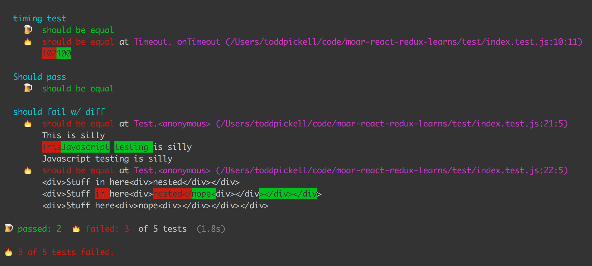
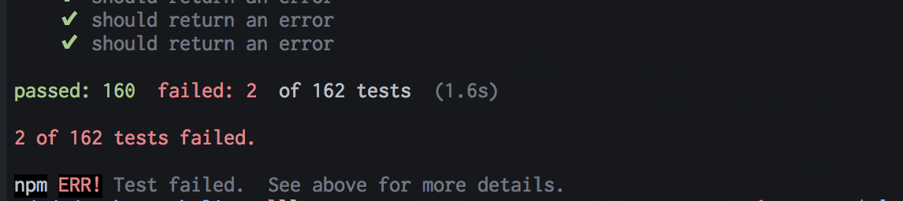

# tap-diff

[](http://badge.fury.io/js/tap-diff)

The most human-friendly [TAP reporter](https://github.com/substack/tape#pretty-reporters).





## How to use

You can use tap-notify in the same way as other [TAP reporters](https://github.com/substack/tape#pretty-reporters).

```
npm install -g tap-diff
```

```
tape ./*.test.js | tap-diff
```

Or use with `createStream()`:

```javascript
var test = require('tape');
var tapDiff = require('tapDiff');

test.createStream()
  .pipe(tapDiff());

process.argv.slice(2).forEach(function (file) {
  require(path.resolve(file));
});
```

## License

MIT
